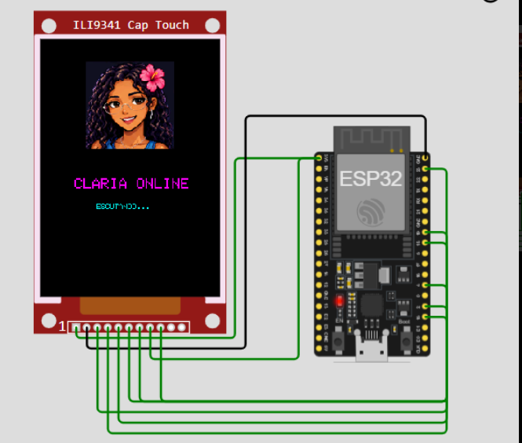
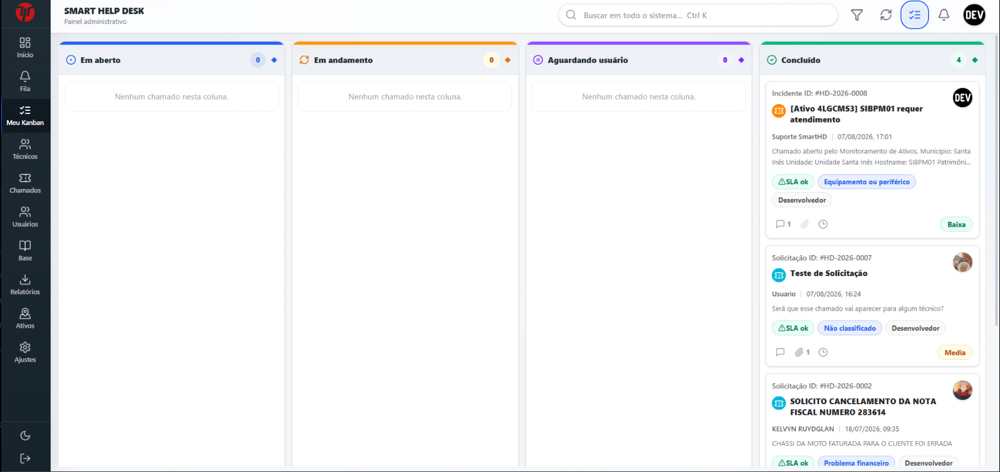
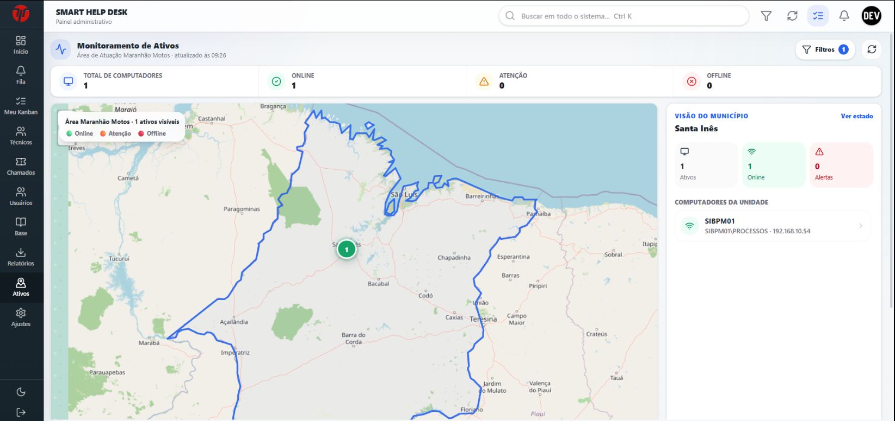

<div align="center">

# 👋 Olá, eu sou Sergio Bergê

### Software Developer • Computer Engineering • Automation • IoT • AI

**Transformando problemas reais em software, automações e dispositivos inteligentes.**

<br>

<a href="https://github.com/BergeS7">
  
</a>


</div>

---

## 👨‍💻 Sobre mim

```typescript
const sergio = {
  role: "Software Developer",
  education: "Computer Engineering",

  interests: [
    "Software Engineering",
    "Artificial Intelligence",
    "Automation",
    "IoT",
    "Embedded Systems",
    "Computer Networks"
  ],

  currentlyBuilding: [
    "CLARIA",
    "Smart HelpDesk Enterprise"
  ],

  philosophy: "Build things that solve real problems."
};
```

Gosto de desenvolver soluções que conectam **software, automação, dados e hardware**.

Meu interesse está principalmente em projetos que ultrapassam a tela e conseguem interagir com **processos, infraestrutura, dispositivos e o mundo real**.

---

# 🛠️ Tecnologias & Ferramentas

## 💻 Linguagens

<div>


&nbsp;&nbsp;

&nbsp;&nbsp;

&nbsp;&nbsp;

&nbsp;&nbsp;

&nbsp;&nbsp;


</div>

<br>

## 🎨 Front-end

<div>


&nbsp;&nbsp;

&nbsp;&nbsp;

&nbsp;&nbsp;

&nbsp;&nbsp;

&nbsp;&nbsp;

&nbsp;&nbsp;


</div>

<br>

## ⚙️ Back-end

<div>


&nbsp;&nbsp;

&nbsp;&nbsp;

&nbsp;&nbsp;


</div>

<br>

## 🗄️ Bancos de Dados

<div>


&nbsp;&nbsp;

&nbsp;&nbsp;

&nbsp;&nbsp;


</div>

<br>

## 🐳 DevOps, Cloud & Ferramentas

<div>


&nbsp;&nbsp;

&nbsp;&nbsp;

&nbsp;&nbsp;

&nbsp;&nbsp;

&nbsp;&nbsp;

&nbsp;&nbsp;

&nbsp;&nbsp;

&nbsp;&nbsp;


</div>

<br>

## 🔌 Hardware & IoT

<div>


&nbsp;&nbsp;


</div>

---

# 🚀 Projetos em Destaque

## 🤖 CLARIA

### Embedded AI Assistant

<div align="center">



</div>

<br>

A **CLARIA** é uma assistente inteligente desenvolvida para combinar **software, Inteligência Artificial e hardware embarcado** em um único dispositivo.

O projeto utiliza um ESP32 com interface gráfica própria e foi projetado para permitir interação natural através de voz, animações e serviços inteligentes.

### ✨ Recursos

* 🎙️ Entrada e reconhecimento de voz
* 🔊 Reprodução e síntese de áudio
* 🧠 Integração com Inteligência Artificial
* 👀 Interface facial animada
* 🙂 Expressões e estados visuais
* 🌐 Comunicação com serviços externos
* 📡 Conectividade Wi-Fi
* 🔌 Hardware embarcado

### 🔧 Hardware

`ESP32` `Display TFT` `INMP441` `MAX98357A` `Speaker`

### 💻 Software

`Python` `C/C++` `AI` `API` `IoT`

### 🏗️ Arquitetura

```text
                 USUÁRIO
                    │
                    ▼
                🎙️ Voz
                    │
                    ▼
              ┌───────────┐
              │   CLARIA  │
              │   ESP32   │
              └─────┬─────┘
                    │
                  Wi-Fi
                    │
                    ▼
              ┌───────────┐
              │  Backend  │
              │   / API   │
              └─────┬─────┘
                    │
                    ▼
              Inteligência
                Artificial
                    │
                    ▼
              ┌───────────┐
              │   ESP32   │
              └─────┬─────┘
                    │
              ┌─────┴─────┐
              ▼           ▼
          🖥️ Display    🔊 Áudio
```

---

# 🎫 Smart HelpDesk Enterprise

### Enterprise IT Support & Infrastructure Platform

O **Smart HelpDesk Enterprise** é uma plataforma desenvolvida para centralizar e modernizar o gerenciamento de suporte e infraestrutura de TI.

O sistema integra chamados, técnicos, SLA, ativos, monitoramento e indicadores em uma única plataforma.

---

## 📋 Kanban de Chamados

<div align="center">



</div>

<br>

O painel Kanban permite acompanhar visualmente o ciclo completo dos atendimentos.

```text
EM ABERTO
    ↓
EM ANDAMENTO
    ↓
AGUARDANDO USUÁRIO
    ↓
CONCLUÍDO
```

### 🎫 Gestão de Atendimento

* Abertura e acompanhamento de chamados
* Kanban de atendimento
* Classificação de chamados
* Definição de prioridades
* Responsáveis e técnicos
* Comentários
* Anexos
* Histórico de movimentações
* Status personalizados
* Controle de SLA

---

## 🗺️ Monitoramento de Ativos

<div align="center">



</div>

<br>

O Smart HelpDesk também possui um módulo de **monitoramento de infraestrutura**, permitindo acompanhar computadores e ativos de TI geograficamente.

### 🖥️ Recursos de Monitoramento

* 🗺️ Visualização dos ativos em mapa
* 🟢 Equipamentos online
* 🔴 Equipamentos offline
* ⚠️ Identificação de alertas
* 🏢 Organização por município
* 🏬 Organização por unidade
* 💻 Identificação individual do computador
* 🌐 Endereço IP
* 📡 Status de conectividade
* 📊 Indicadores gerais da infraestrutura

### ⚡ Monitoramento

```text
AGENTE
  │
  ├── Hostname
  ├── IP
  ├── Hardware
  ├── Sistema
  └── Status
        │
        ▼
       API
        │
        ▼
   Smart HelpDesk
        │
        ├── Dashboard
        ├── Mapa
        ├── Alertas
        └── Chamados
```

Um problema identificado pelo monitoramento pode ser integrado ao próprio fluxo de atendimento da plataforma.

---

## ⚙️ Recursos da Plataforma

<table>

<tr>

<td>🎫 <b>Chamados</b></td>
<td>Gerenciamento completo do atendimento</td>

</tr>

<tr>

<td>📋 <b>Kanban</b></td>
<td>Gestão visual do fluxo de trabalho</td>

</tr>

<tr>

<td>⏱️ <b>SLA</b></td>
<td>Controle de prazos de atendimento</td>

</tr>

<tr>

<td>👨‍💻 <b>Técnicos</b></td>
<td>Gestão de equipes e responsáveis</td>

</tr>

<tr>

<td>👥 <b>Usuários</b></td>
<td>Perfis e permissões</td>

</tr>

<tr>

<td>🖥️ <b>Ativos</b></td>
<td>Inventário e monitoramento</td>

</tr>

<tr>

<td>🗺️ <b>Mapa</b></td>
<td>Visualização geográfica da infraestrutura</td>

</tr>

<tr>

<td>📚 <b>Base</b></td>
<td>Base de conhecimento</td>

</tr>

<tr>

<td>📊 <b>Relatórios</b></td>
<td>Indicadores operacionais</td>

</tr>

<tr>

<td>⭐ <b>Satisfação</b></td>
<td>Avaliação dos atendimentos</td>

</tr>

</table>

### 💻 Stack

`React` `TypeScript` `Node.js` `PostgreSQL` `Docker` `REST API`

---

# 🔬 Áreas que estou explorando

```text
Software Engineering
│
├── Full Stack Development
├── APIs & Microservices
├── Software Architecture
├── Automation
└── DevOps


Artificial Intelligence
│
├── AI Assistants
├── Voice Interfaces
├── Intelligent Automation
└── AI Integration


Embedded Systems
│
├── ESP32
├── IoT
├── Sensors
├── Displays
└── Connected Devices


IT Infrastructure
│
├── Computer Networks
├── Asset Monitoring
├── Infrastructure Automation
└── Observability
```

---

# 📊 GitHub Analytics

<div align="center">


</div>

---

# 📈 Atividade

<div align="center">


</div>

---

# 🧠 Atualmente

```text
🤖 CLARIA
   └── AI + ESP32 + Voice + Embedded Systems

🎫 Smart HelpDesk
   └── Software + Infrastructure + Automation

⚙️ Automation
   └── Python + APIs + Process Improvement

🔌 IoT
   └── ESP32 + Sensors + Connected Devices
```

---

# 📫 Contato

<div align="center">

### Vamos construir algo interessante?

<br>

<a href="mailto:sergioberge07@gmail.com">
  
</a>

<a href="https://github.com/BergeS7">
  
</a>

<a href="https://oigresyt7-blip.github.io/oigresyt7-blip.gitihub.io/">
  
</a>

<a href="https://www.instagram.com/sergio_berge/">
  
</a>

</div>
